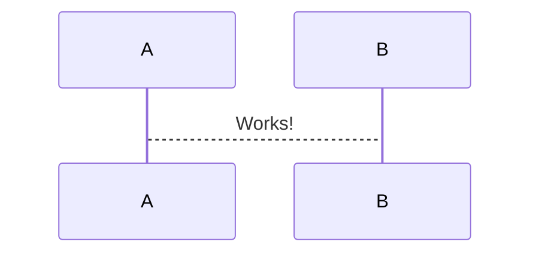
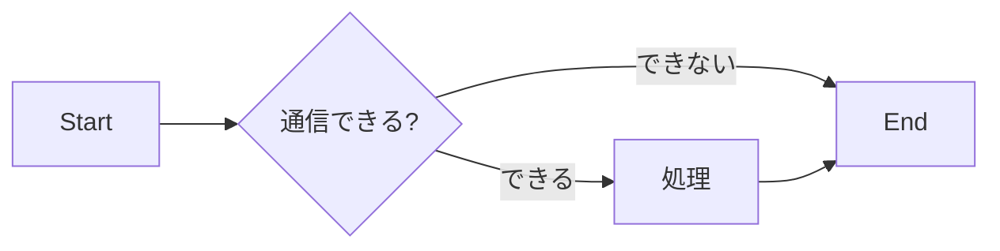

# ryLogin





```mermaid
gantt
  title ガントチャートテスト
  dateFormat YYYY-MM-DD
  section 製品A開発セクション
  設計       : done,   task1, 2017-12-11,  2017-12-15
  実装       : active, task2, 2017-12-18,  5d
  単体テスト  :         task3, after task2, 5d
  結合テスト  :         task4, after task3, 5d
  ```