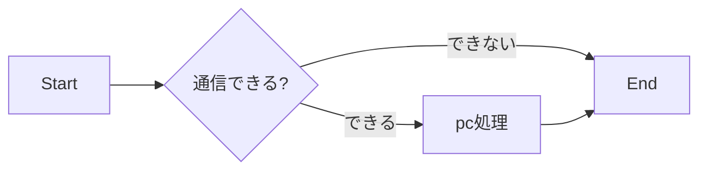
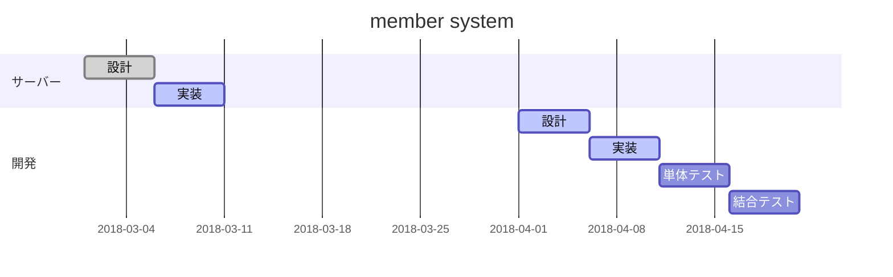

# chart gantt

```mermaid
graph LR
  ST[Start] --> IF1{通信できる?}
  IF1 -->|できる| PC1[pc処理]
  IF1 -->|できない| ED[End]
  PC1 --> ED
```

```mermaid
gantt
  title member system
  dateFormat YYYY-MM-DD
  section サーバー
  設計       : done, taskA1, 2018-3-1, 5d
  実装       : active, taskA2, after taskA1, 5d
  %% comment
  section 開発
  設計       : active, task1, 2018-4-1,  5d
  実装       : active, task2, after task1,  5d
  単体テスト  :         task3, after task2, 5d
  結合テスト  :         task4, after task3, 5d
```
